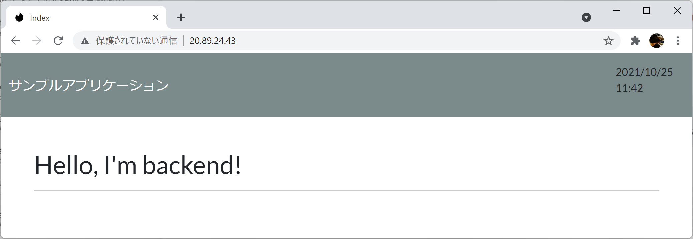

# Chaos Sample using Azure Kubernetes Service/Spring Boot

[Azure Kubrnetes Service](https://docs.microsoft.com/ja-jp/azure/aks/)上で動くSpring Bootアプリケーションに対して[Chaos Studio](https://docs.microsoft.com/ja-jp/azure/chaos-studio/)を使ったカオス挿入を行います。

## Azure Kubrnetes Serviceクラスタの作成

```bash
RG_NAME=aks-chaos
AKS_NAME=aks-chaos
ACR_NAME=acrchaosxxxxx
```

### ACRの作成

次のコマンドでACRを作成します。
```bash
az group create \
    -n $RG_NAME \
    -l japaneast

az acr create \
    -n $ACR_NAME \
    -g $RG_NAME \
    --sku basic
```

### AKSの作成
次のコマンドでクラスタを作成します。

```bash
az aks create \
    -g $RG_NAME \
    -n $AKS_NAME \
    --node-count 2 \
    --enable-addons monitoring \
    --attach-acr $ACR_NAME \
    --generate-ssh-keys
```

クラスタが作成できたら、次のコマンドでクラスタの接続に必要なクレデンシャルを取得します。

```bash
az aks get-credentials \
    -g $RG_NAME \
    -n $AKS_NAME
```

kubectlは、Kubernetesのリソースを操作するためのCLIです。
次のコマンドを実行してkubectlをインストールし、クラスタのノード一覧を表示します。

```bash
az aks install-cli
kubectl get node
```


## Spring Bootによるコンテナアプリケーションの開発

テスト用のアプリケーションをデプロイします。


### Build/Share

chaos-frontendおよびchaos-backendをビルド/コンテナイメージを作成し、コンテナレジストリで共有します。

```bash
az acr login --name $ACR_NAME
```

#### backendアプリ

backendアプリのコンテナイメージを作成し、レジストリにPushします。

```bash
cd apps/backend
./mvnw spring-boot:build-image -Dspring-boot.build-image.imageName=$ACR_NAME.azurecr.io/chaos-backend:v1
docker push $ACR_NAME.azurecr.io/chaos-backend:v1
```

#### frontendアプリ

frontendのアプリのコンテナイメージを作成し、レジストリにPushします。

```bash
cd apps/frontend.before
./mvnw spring-boot:build-image -Dspring-boot.build-image.imageName=$ACR_NAME.azurecr.io/chaos-frontend:v1
docker push $ACR_NAME.azurecr.io/chaos-frontend:v1
```

### Kubernetesクラスタへのデプロイ

次のコマンドでクラスタの構成を確認します。

```bash
kubectl get svc,deployment,pod
```

クラスタにはまだアプリケーションが何もデプロイされていません。


#### backendアプリのデプロイ

Kubernetesマニフェストからbackendアプリをクラスタにデプロイします。

```bash
cd manifest/backend

kubectl apply -f service.yaml -f deployment.yaml 
```

DeploymentとServiceを確認します。

```bash
kubectl get deploy,service
```

#### frontendアプリのデプロイ

Kubernetesマニフェストからfrontアプリをクラスタにデプロイします。

```bash
cd manifest/frontend

kubectl apply -f service.yaml -f deployment.yaml 
```

DeploymentとServiceを確認します。

```bash
kubectl get deploy,service
```

### 動作確認

frontendアプリのエンドポイントを確認します。

```bash
kubectl get svc
```

Webブラウザから次のURLにアクセスします。

```bash
http://<frontend External IP>/
```



動いているアプリケーションのログを確認するには、次のコマンドを実行します。

```bash
kubectl logs -f <pod name>
```


# Chaos Studioによるカオス挿入
Chaos Studioを使って、Kubernetesクラスタにカオスを挿入します。


## Chaos Meshを設定する

AKSクラスターにChaos Meshをインストールします。

```bash
helm repo add chaos-mesh https://charts.chaos-mesh.org
helm repo update
kubectl create ns chaos-testing
helm install chaos-mesh chaos-mesh/chaos-mesh \
    --namespace=chaos-testing \
    --version 2.0.3 \
    --set chaosDaemon.runtime=containerd \
    --set chaosDaemon.socketPath=/run/containerd/containerd.sock
```

Chaos Meshの確認を行います。

```bash
kubectl get po -n chaos-testing
```

## AKSクラスターでChaos Studioを有効にする

AKSクラスタのリソースIDを確認します。

```bash
RESOURCE_ID=$(az aks list --query "[].id" -o tsv)
```

AKSクラスタでChaos Studioを有効化します

```bash
az rest --method put \
    --url "https://management.azure.com/$RESOURCE_ID/providers/Microsoft.Chaos/targets/Microsoft-AzureKubernetesServiceChaosMesh?api-version=2021-09-15-preview" \
    --body "{\"properties\":{}}"
```

## Pod障害の注入
[Chaos Studioの障害およびアクション ライブラリ](https://docs.microsoft.com/ja-jp/azure/chaos-studio/chaos-studio-fault-library)を確認します。

```bash
CAPABILITY=PodChaos-2.1
```

```bash
az rest --method put \
    --url "https://management.azure.com/$RESOURCE_ID/providers/Microsoft.Chaos/targets/Microsoft-AzureKubernetesServiceChaosMesh/capabilities/$CAPABILITY?api-version=2021-09-15-preview"  \
    --body "{\"properties\":{}}"
```

`$SUBSCRIPTION_ID`、`$RESOURCE_GROUP`、`$EXPERIMENT_NAME` を環境に合わせて変更し`experiment.json`を作成します。

```bash
SUBSCRIPTION_ID=xxxxxxxxxxxxxxxxxxxxxxxxxxxx
EXPERIMENT_NAME=pod-failure

cd chaos
az rest --method put \
    --uri https://management.azure.com/subscriptions/$SUBSCRIPTION_ID/resourceGroups/$RG_NAME/providers/Microsoft.Chaos/experiments/$EXPERIMENT_NAME?api-version=2021-09-15-preview \
    --headers "Content-Type=application/json" \
    --body @experiment.pod.json -o json
```


AKS クラスターにアクセス許可を付与するため
上記コマンドの実行結果から以下の値を取得し、環境変数に設定します。

```bash
"principalId": "xxxxxxxxxxxxxxxxxxxxxxxxxxxx",
```

```bash
EXPERIMENT_PRINCIPAL_ID=xxxxxxxxxxxxxxxxxxxxxxxxxxxx
```

```bash
az role assignment create \
    --role "Azure Kubernetes Service Cluster Admin Role" \
    --assignee-object-id $EXPERIMENT_PRINCIPAL_ID \
    --scope $RESOURCE_ID
```


次のコマンドで実験を実行します

```bash
az rest --method post \
    --uri https://management.azure.com/subscriptions/$SUBSCRIPTION_ID/resourceGroups/$RG_NAME/providers/Microsoft.Chaos/experiments/$EXPERIMENT_NAME/start?api-version=2021-09-15-preview
```


## DNS障害の注入
[Chaos Studioの障害およびアクション ライブラリ](https://docs.microsoft.com/ja-jp/azure/chaos-studio/chaos-studio-fault-library)を確認します。

```bash
CAPABILITY=DNSChaos-2.1
```

Chaos DNS Serviceのインストールをします。

```bash
helm upgrade chaos-mesh chaos-mesh/chaos-mesh \
    --namespace=chaos-testing \
    --version 2.0.3 \
    --set dnsServer.create=true
kubectl get pods -n chaos-testing -l app.kubernetes.io/component=chaos-dns-server
```

```bash
az rest --method put \
    --url "https://management.azure.com/$RESOURCE_ID/providers/Microsoft.Chaos/targets/Microsoft-AzureKubernetesServiceChaosMesh/capabilities/$CAPABILITY?api-version=2021-09-15-preview"  \
    --headers "Content-Type=application/json" \
    --body "{\"properties\":{}}"
```

`$SUBSCRIPTION_ID`、`$RESOURCE_GROUP`、`$EXPERIMENT_NAME` を環境に合わせて変更し`experiment.json`を作成します。

```bash
SUBSCRIPTION_ID=xxxxxxxxxxxxxxxxxxxxxxxxxxxx
EXPERIMENT_NAME=dns-failure

cd chaos
az rest --method put \
    --uri https://management.azure.com/subscriptions/$SUBSCRIPTION_ID/resourceGroups/$RG_NAME/providers/Microsoft.Chaos/experiments/$EXPERIMENT_NAME?api-version=2021-09-15-preview \
    --headers "Content-Type=application/json" \
    --body @experiment.dns.json -o json
```

AKS クラスターに実験のアクセス許可を付与するため
上記コマンドの実行結果から以下の値を取得し、環境変数に設定します。

```json
"principalId": "xxxxxxxxxxxxxxxxxxxxxxxxxxxxxx",
```

```bash
EXPERIMENT_PRINCIPAL_ID=xxxxxxxxxxxxxxxxxxxxxxxxxxxxxx
```

```bash
az role assignment create \
    --role "Azure Kubernetes Service Cluster Admin Role" \
    --assignee-object-id $EXPERIMENT_PRINCIPAL_ID \
    --scope $RESOURCE_ID
```


次のコマンドで実験を実行します。

```bash
az rest --method post \
    --uri https://management.azure.com/subscriptions/$SUBSCRIPTION_ID/resourceGroups/$RG_NAME/providers/Microsoft.Chaos/experiments/$EXPERIMENT_NAME/start?api-version=2021-09-15-preview
```


# クリーンアップ

検証が終わりクラスタが不要になったらクラスタのリソースグループを削除します。

```bash
az group delete --name $RG_NAME 
```

---
Enjoy! 🍖🍺
